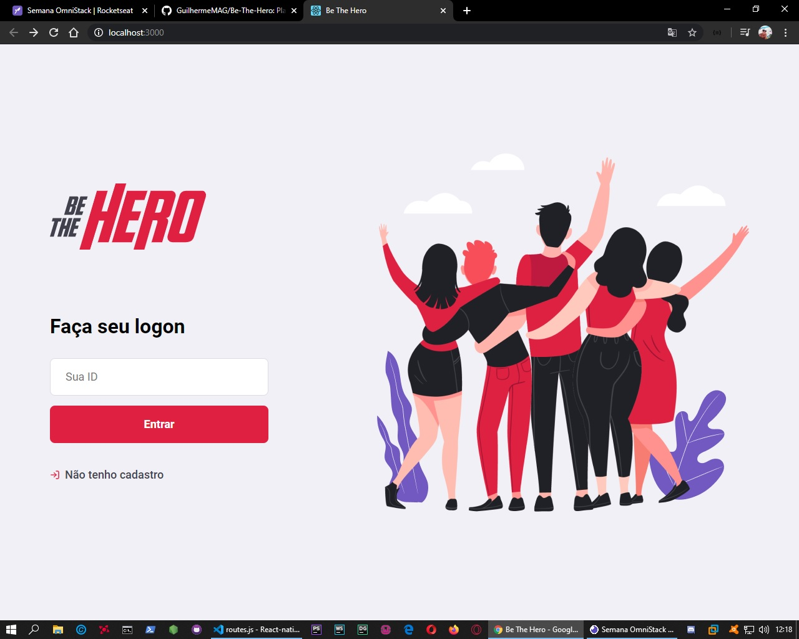

# React-native-project
 Plataforma de auxilio a ONG's de uso fácil e Prático.

 <!DOCTYPE html>
<html lang="Pt-BR">
  <head>
   <title>Be The Hero</title>
  </head>
  <body>
    <hgroup>
    <h1>Galeria de Fotos</h1>
      
  </body>
</html>

# Be The Hero

 Plataforma de auxilio a ONG's de uso fácil e Prático.

/** link **/

<!DOCTYPE html>

<html lang="pt-br">

<head>
    <meta charset="utf-8"/>
</head>
<body>

<header id="#">

<nav id="#">
    <h2>Menu</h2>
<ul>
    <li><a href="index.html">Home</a></li>
    <li><a href="#">Especificações</a></li>
    <li><a href="fotos.html">Fotos</a></li>
    <li><a href="multimidia.html">Multimídia</a></li>
    <li><a href="fale-conosco.html">Fale conosco</a></li>
</ul>

</nav>

</header>

<section id="#">
<article id="#">
    <header id="#">
<hgroup>
    <h3>Home</h3>
    <h1><a href="https://guilhermemag.github.io/" target="_blank"> Meu Portfólio </a></h1> 
  
</hgroup>
    </header>

<h3> </h3>

 

<figure class="#">

    <figcaption>
        <h3> </h3>
        
 

    </figcaption>
</figure>

<h3> </h3>

 

<h3> </h3>

 
<h3> </h3>

 

<h3> </h3>

 

</article>
</section>

<h2> </h2>

 

 

</aside>

</footer>

</body>
</html>

