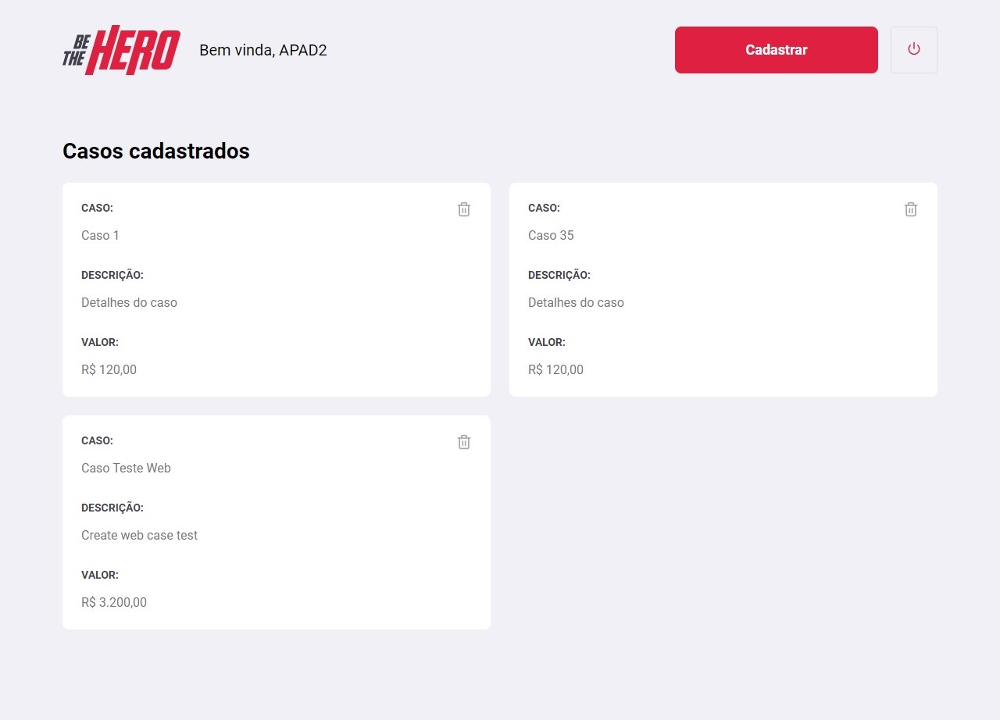

<h1 align="center">
    
</h1>

<h4 align="center"> 
🚀 Semana OmniStack 11.0
</h4>

<a aria-label="Completed" href="https://rocketseat.com.br/week-10/aulas#4">
    </img>
  </a>
  

  <a href="#-project">Project</a>&nbsp;&nbsp;&nbsp;|&nbsp;&nbsp;&nbsp;
  <a href="#rocket-Technologies">Technologies</a>&nbsp;&nbsp;&nbsp;|&nbsp;&nbsp;&nbsp;
  <a href="#-layout">Layout</a>&nbsp;&nbsp;&nbsp;|&nbsp;&nbsp;&nbsp;
  <a href="#-how-to-contribute">How to contribute</a>&nbsp;&nbsp;&nbsp;|&nbsp;&nbsp;&nbsp;
  <a href="#rocket-web">Web</a>&nbsp;&nbsp;&nbsp;|&nbsp;&nbsp;&nbsp;
  <a href="#rocket-mobile">Mobile</a>&nbsp;&nbsp;&nbsp;|&nbsp;&nbsp;&nbsp;
  <a href="#memo-license">License</a>

## 💻 Project

Be The Hero is a project that aims to connect people who are willing to help ONGs.

<h1 align="center">
    
</h1>

## :rocket: Technologies

This project was developed with the following technologies:

- [Node.js](https://nodejs.org/en/)
- [React](https://reactjs.org)
- [React Native](https://facebook.github.io/react-native/)
- [Expo](https://expo.io/)

## 🔖 Layout

To access the layout use the tool [Figma](https://www.figma.com/file/2C2yvw7jsCOGmaNUDftX9n/Be-The-Hero---OmniStack-11?node-id=0%3A1).

# :rocket: Web

## Logon

## Registration of NGOs

## Register of Cases

## Cases List

# :rocket: Mobile

## Splash

## Cases List

## Cases Details

## Contact By WhatsApp ou E-mail

## 🤔 How to contribute

- Make a fork;
- Create a branck with your feature: `git checkout -b my-feature`;
- Commit changes: `git commit -m 'feat: My new feature'`;
- Make a push to your branch: `git push origin my-feature`.

After merging your receipt request to done, you can delete a branch from yours.

#api #nodejs #backend #frontend #react #reactnative #appdeveloper #rocketseat #omnistack #developer

## :memo: License

This project is under the MIT license. See the [LICENSE](LICENSE.md) for details.

---

Made by Guilherme Augusto Borges Casagrande [Get in touch!](https://www.linkedin.com/in/guilherme-augusto-borges-casagrande-771a27160/) <- LinkedIn

Made by Guilherme Augusto Borges Casagrande [Get in touch!](https://guilhermemag.github.io/) <- Portifólio

Para executar a aplicação
Execute npm install nas pastas backend, frontend e mobile, para instalar as dependências.

Rode npm start nas pastas backend e frontend para utilizar a versão web. Acesse via localhost:3000.

Rode npm start nas pastas backend e mobile, acesse localhost:19002, leia o QR Code no seu celular e utilize o aplicativo Expo para rodar a versão mobile no seu smartphone. Também é possível executar em algum emulador Android/iOS.

Veja também esse vídeo feito pelo christyanbrayan com a demonstração das versões web e mobile rodando localmente.

