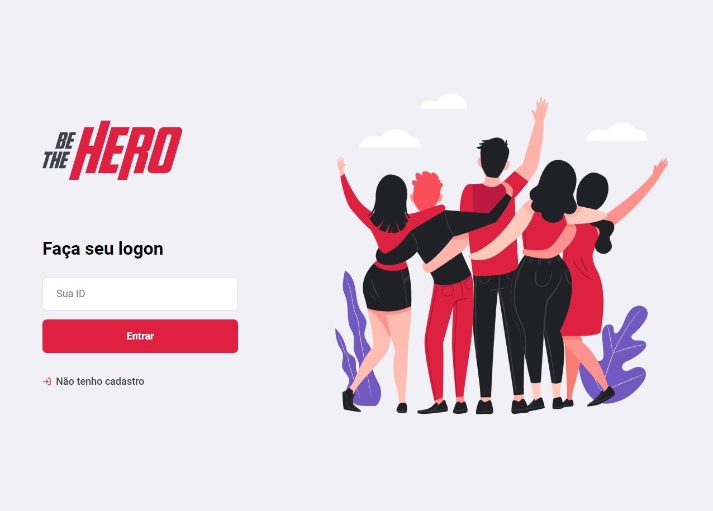

# Be The Hero

 Plataforma de auxilio a ONG's de uso fácil e Prático.

/** aqui vai um link **/

<!DOCTYPE html>

<html lang="pt-br">

<head>
    <meta charset="utf-8"/>
</head>
<body>

<h1>Web</h1>
<h2>Logon</h2>

<h2>Cadastro de ONG's</h2>

<h2>Cadastro de Casos</h2>

<h2>Lista de Casos</h2>

<h1>Mobile</h1>
<h2>Splash</h2>

<h2>Lista de Casos</h2>

<h2>Detalhes do Caso</h2>

<h2>Contato Via WhatsApp ou E-mail</h2>

<h1><a href="https://guilhermemag.github.io/" target="_blank"> Meu Portfólio </a></h1> 
  
</body>
</html>

